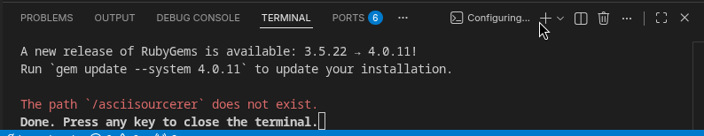

= DocOps Box
// tag::global-settings[]
:this_proj_slug: box
:this_proj_name: DocOps Box
// tag::universal-settings[]
// ALL changes within this block must be made in prime template:
//  DocOps/lab/gems/docopslab-dev/templates/README.asciidoc
:docopslab_src_www_url: https://github.com/DocOps
:docopslab_domain: docopslab.org
:docopslab_www_url: https://{docopslab_domain}
:docopslab_io_www_url: https://docopslab.github.io
:docopslab_ruby_version: 3.3
:docopslab_git_src_uri: git@github.com:DocOps
:docopslab_src_raw_url: https://raw.githubusercontent.com/DocOps
:this_proj_src_www_url: {docopslab_src_www_url}/{this_proj_slug}
:this_proj_src_raw_url: {docopslab_src_raw_url}/{this_proj_slug}
:this_proj_src_main_raw_url: {this_proj_src_raw_url}/main
:this_proj_src_main_files_url: {this_proj_src_www_url}/blob/main
:this_proj_src_git_uri: {docopslab_git_src_uri}/{this_proj_slug}.git
:this_proj_ruby_version: {docopslab_ruby_version}
// tag::env-settings[]
:docs_extn:
ifdef::env-github[]
:docs_extn: .adoc
:icons: font
:caution-caption: :fire:
:important-caption: :exclamation:
:note-caption: :paperclip:
:tip-caption: :bulb:
:warning-caption: :warning:
endif::[]
// end::env-settings[]
// Settings likely to be overridden locally
:this_prod_slug: {this_proj_slug}
:this_prod_name: {this_proj_name}
:this_prod_src_www_url: {this_proj_src_www_url}
// end::universal-settings[]
:this_prod_slug: docopsbox
:latest_ruby_version: 3.4
:default_ruby_version: {docopslab_ruby_version}
:default_nodejs_version: 24
:this_proj_vrsn: 0.1.0
:next_proj_vrsn: 0.2.0
:this_proj_src_latest_raw_url: {this_proj_src_raw_url}/refs/heads/latest
:docopsbox_dockerfile_src_www_url: {this_proj_src_www_url}/tree/latest/Dockerfile
:compose_config_file: {this_prod_slug}.yml
:compose_config_path: .config/{compose_config_file}
:document: website
ifdef::env-github[]
:document: README
endif::[]
:experimental:
:gref: pass:q[^🔖^]
:proj_issues_url: {docopslab_src_www_url}/issues
:docopslab_proj_aylstack_src_wwww: https://docopslab.org/projects/ayl-docstack/
:asciidoctor_home_url: https://asciidoctor.org
:kramdoc_home_url: https://github.com/asciidoctor/kramdown-asciidoc
:nokogiri_home_url: https://nokogiri.org
:pandoc_home_page: https://pandoc.org
:tilt_home_url: https://github.com/rtomayko/tilt
:vale_home_page: https://vale.sh
:redoclycli_home_url: https://redocly.com/docs/cli
:speakeasycli_home_url: https://www.speakeasy.com/docs/speakeasy-reference/cli
:vacuum_home_url: https://quobix.com/vacuum/
:liquid_home_url: https://shopify.github.io/liquid
:jekyll_home_url: https://jekyllrb.com
:git_home_url: https://git-scm.com
:ohmyzsh_home_url: https://ohmyz.sh
:nano_home_url: https://www.nano-editor.org
:vim_home_url: https://www.vim.org
:libreoffice_home_url: https://www.libreoffice.org
// end::global-settings[]
:toc: macro
:toclevels: 2

Get up and running with docs-as-code!
DocOps Box is a documentation multi-tool for your Mac or PC.

This project includes an introductory guide and quick-start procedure for establishing and maintaining a broadly capable environment for *documentation and document-processing* work.

DocOps Box uses *Docker* and *VS Code Dev Containers* to provide a consistent, reproducible environment for digital documentation and document management work across different operating systems and team members.

The provided system also works for solo practitioners who want a stable, isolated environment for their documentation projects without the hassle of managing dependencies on their host system.

Even if you use none of the software provided here, this guide should still be helpful for anyone orienting to the world of docs-as-code tools and workflows.
It includes a section for <<ruby-for-real,"`native installation`">> of all the tools supported by the container approach, so you can choose your own adventure if you prefer to set up your workstation without Docker.

toc::[]

[[intro]]
== Introduction

This project is geared as a guide and assets for meeting *_non_-developer tech or clerical workers*, typically on their *Windows* or maybe *MacOS* systems, not yet set up as "`development environments`" with tools like [.buzz]*Ruby*, [.buzz]*Node.js*, [.buzz]*Python*, [.buzz]*Git*, [.buzz]*Pandoc*, [.buzz]*Vale* and the world of capabilities that these tools open up.

[NOTE]
This entire project is geared toward *Windows, Mac, _and_ Linux* users, but it assumes virtually zero [.term.term-unixlike]#Linux/Unix# knowledge or preference.
You will be using a command line (terminal), and it needs to be (1) Mac-based or (2) Linux-based (including via WSL2 on Windows).

This project is intended to meet users where I have found these "`tech-savvy non-programmers`" among my clients the past several years, such as [.buzz]*technical writers*, [.buzz]*project managers*, and professional [.buzz]*document wranglers* like [.buzz]*paralegals*, non-software [.buzz]*engineers*, [.buzz]*researchers*, and [.buzz]*educators*.

This toolkit is intended to provide a proper swath of technologies in the form of a *specially designed [.buzz]#Docker# [.term]#image#*<<gloss-image,{gref}>> you can run as a [.term]#container#<<gloss-container,{gref}>> on your system, whatever that system may be.

DocOps Box is specifically geared toward the link:{docopslab_proj_aylstack_src_wwww}[[.buzz]#AYL DocStack#]: applications using *AsciiDoc*, *YAML*, and *Liquid* to build documents and documentation.
However, the `max` images can handle a huge swath of the most common tools and formats used in the docs-as-code world, such as *JavaScript*, *Markdown*, *reStructuredText*, *JSON*, *XML*, and more.

[NOTE]
DocOps Box is tested on *Docusaurus*, *Antora*, *Astro*, *Jekyll*, *MkDocs*, *Sphinx*, and *11ty*.
The `max` images are suitable for projects running any of these platforms as well as all the pre-installed tools found in <<tooling-overview>>.

The main intent is to provide the basics for these fairly technical/non-expert users to operate with the power of advanced "`docs-as-code`" techniques that only programmers, hackers, and IT professionals have typically bothered messing with until recently.
See <<who-for>> for more on the intended user base and *use cases* for this project.

If you know you want to get started with DocOps Box, skip to <<prerequisites>> and perform any necessary installations there.

The next few sections are for users who want to understand the rationale and context for this project before diving in.

[[when-to-use]]
=== When to Use DocOps Box

This project is not intended to be a "`one size fits all`" solution for every docs-as-code project;
it is optimized for relatively complex situations (multiple projects, multiple/complex toolchains, etc).

Use this table to decide if DocOps Box is right for your situation.

[cols="1,1",options="header"]
|===
| Scenario | Recommendation

| You occasionally use one or two DocOps Lab tools
| Use each tool's own Docker image directly

| You regularly use multiple DocOps Lab tools
| Use DocOps Box (`min` or `max` image)

| Your toolchain uses Ruby and Node/Python tools
| Use a DocOps Box `max` image

| Your toolchain uses runtimes other than Ruby, Node, or Python
| DocOps Box will be partially helpful or unsuitable; advanced users might consider <<extending,extending the image>>

| You are setting up a team documentation environment
| Use DocOps Box with a shared `.env` file in Git

| You need a [.term]#CI/CD#<<gloss-ci-cd,{gref}>> pipeline for docs automation
| Use DocOps Box `live` image
|===

[[native-vs-docopsbox]]
=== Native Install vs DocOps Box

DocOps Box, as a project, is not about pushing you into using _any_ specific software, including our Docker images or our `dxbx` script.

Full native installation instructions for _all_ core DocOps Box-supported components are included in an appendix: <<ruby-for-real>>.

[cols="1,1,1",options="header"]
|===
| Criterion | Native Install | DocOps Box

| Setup time (first use)
| 45-90 min
| ~5 min

| Reproducibility across machines
| High effort
| Automatic via config files

| Team-wide standardization
| Requires active coordination, docs
| Git-committed `.env` + `{compose_config_file}`

| Works on Windows
| WSL2 + manual setup
| WSL2 + Docker

| IDE integration [.nowrap]#(VS Code)#
| Full native
| Full via Dev Containers extension

| Per-project dependencies isolation
| As configured per runtime/project
| Named volumes <<gloss-volume,{gref}>> handled by `dxbx`

| Suitable for CI/CD
| Requires environment setup steps
| Available via `live` image
|===

[[tooling-overview]]
=== Tooling Overview

The only real prerequisite for the "`Dockerized`" ("`containerized`") approach to establishing a robust DocOps environment, as provided in this project, is that you have Docker working on top of a [.term.term-unixlike]#Unix-like# [.term]#shell#<<gloss-shell,{gref}>>.

It makes the most sense for users who need a consistent mix of tools across multiple projects;
setting up a separate Docker image per tool is at least as complicated as a native install.

[NOTE.windows]
*Windows* users will need to set up a WSL2 kernel and a Linux distribution if they have not already done so.
This much is true of any Windows-based approach advised by this project.

Technologies included in the DocOps Box Docker images are:

[.buzz]
Zsh::
The powerful and elegant terminal shell environment that is more user-friendly than Bash, already configured with link:{ohmyzsh_home_url}[OhMyZsh^].
`work` images only; `live` images use Bash

{git_home_url}[Git^]::
The most popular version control system, which is used to track changes to your codebase and to share it with others

Ruby::
A [.term]#runtime environment#<<gloss-runtime,{gref}>> for executing Ruby command-line utilities and managing Ruby dependencies

Node.js::
A [.term]#runtime environment# for numerous auxiliary tools that have no Ruby equivalent; included in `max` images only

Python::
A runtime environment for the inevitable Python utilities; included in `max` images only

{pandoc_home_page}[Pandoc^]::
An extraordinary document migration utility that can convert between a huge range of formats

{vale_home_page}[Vale^]::
A document validation utility (linter) that can check markup-formatted writing for consistent style and preferred grammar

OpenAPI tools::
Three excellent [.term]#OpenAPI Specification#<<gloss-oas,{gref}>> utilities, for validating/linting [.term]#OAS# documents and generating API reference documentation from them ({redoclycli_home_url}[Redocly CLI], {vacuum_home_url}[Vacuum], and link:{speakeasycli_home_url}[Speakeasy CLI])

text editors::
The images provide the {nano_home_url}[GNU nano^] (default) and {vim_home_url}[Vim^], [.term]#TUI#<<gloss-tui,{gref}>> utilities for quick edits in the interactive shell.

LibreOffice::
Powerful CLI utilities behind the popular office suite; included automatically in `max` images

Ruby tools::
Out of the box (so to speak): link:{asciidoctor_home_url}[Asciidoctor^] (`.adoc` -> `.html`/`.pdf`/`.epub`), link:{kramdoc_home_url}[Kramdown-AsciiDoc^] (`.md` -> `.adoc`), link:{nokogiri_home_url}[Nokogiri^] (HTML/XML parsing), and other handy Ruby gems.
Add your own per project using `Gemfile`; see <<adding-dependencies>>.

See link:{docopsbox_dockerfile_src_www_url}[the project's `Dockerfile`] for the full list of installed packages and utilities.
Many are secondarily documented below in <<auxilliary-tools>> as well as <<ruby-for-real>>.

This environment is suitable for users to execute [.term]*scripts* and [.term]*runtime applications* like the ones I provide for and use with my clients.
It's what you need to apply my or anyone else's Ruby-based documentation [.term]*toolchain* or [.term]*tech stack* to your specific purposes.

This project should also suit if your toolchain is [.buzz]*Javascript*-based ([.buzz]*Docusaurus*, [.buzz]*Antora*, [.buzz]*Next.js*, [.buzz]*SvelteKit*, [.buzz.buzz-eleventy]*11ty*, [.buzz]*Astro*, etc) or *Python*-based ([.buzz]*Sphinx/ReadTheDocs*, [.buzz]*MkDocs*).
However, if your toolchain excludes Ruby altogether, this Ruby-centric project might not be the most efficient route to a stable coding environment.

[[prerequisites]]
== Prerequisites

All of the software required to run DocOps Box is *free*, *open source*, and strongly *recommended* for any modern code-like documentation workflow.
You cannot go wrong having VS Code and Docker on your workstation, even if you do not end up using DocOps Box over the long term.

[NOTE]
This document is intended to guide you to competency in the world of docs-as-code, not merely using `dxbx` and the `docopslab/box` containers as a crutch.

Work through the following steps in order; each one is a prerequisite for the next.

Prerequisites::
* <<prereq-terminal,Terminal app>>
* <<prereq-vscode,VS Code>>
* <<prereq-bash4,Bash 4+ (MacOS only)>>
* <<prereq-wsl2,WSL2 (Windows only)>>
* <<prereq-curl,Curl>>
* <<prereq-docker,Docker>>
This section is somewhat long, but all of these apps are critical, some are likely already available on your system, and this guide covers installing them on any major platform.

[[prereq-terminal]]
=== Find or Install a Terminal App

There is no avoiding the command line in the docs-as-code world.
If you already have a terminal you like, use it and skip ahead.
If not, here are my recommendations per operating system.

[[vs-code-terminal]]
==== VS Code Terminal

The quickest start on *all platforms* is to use the built-in terminal in Visual Studio Code.

[TIP]
VS Code is a strongly recommended prerequisite for this project anyway;
<<prereq-vscode,skip right to it>> if you want to start with just VS Code's terminal.

Unless otherwise configured, VS Code's terminal uses your host system's default shell, which is PowerShell on Windows and Zsh on MacOS.
Once WSL2 is installed on Windows, VS Code should detect it and prompt you to switch to it when you open a terminal.

[NOTE]
Even if you already have VS Code installed, be sure to <<prereq-vscode,add the Dev Containers extension>>.

The remainder of this section advises Windows, MacOS, and Linux users who want to use a terminal app outside of VS Code.

[[warp-terminal]]
==== Warp and Wave

By far my two favorite terminal apps are Warp and Wave.

Both are freemium open-source models with generous free tiers.

Warp has a fully integrated terminal that can be a little bit overwhelming.

Wave is a chat-only tool for now, so you have to copy and paste commands and output back and forth, though the chat can automatically read local files.

* link:https://www.warp.dev/terminal[Download Warp] (downloads for all platforms in page footer)
* link:https://www.waveterm.dev/download[Download Wave] (downloads for all platforms in page footer)

[[native-installs]]
==== Native Terminal Apps

If you prefer to install from an app store or package manager, here are some good options on all three platforms.

* *Windows users* can use the built-in Windows Terminal, which supports multiple shells including PowerShell and WSL2.
If it's not installed, get it from the Microsoft Store: link:https://www.microsoft.com/en-us/p/windows-terminal/9n0dx20hk701[Windows Terminal].

* *MacOS users* can use the built-in Terminal app, but most users prefer link:https://iterm2.com/downloads.html[iTerm2], which is also available as a Homebrew package:
+
[.prompt]
 brew install --cask iterm2

* *Linux users* are unlikely to find better options than Wave or Warp.
If you are a Linux user who does not already have a preference, try one of those or your distro's default terminal app.

[[prereq-vscode]]
=== VS Code (All Systems)

The recommended daily workflow uses VS Code with the Dev Containers extension.

[NOTE]
VS Code is not truly a _requirement_ for the DocOps Box workflow, but it is strongly recommended for novice users without a strong reason to choose another workflow.
Your favorite IDE/text editor is just as valid, in combination with its own terminal or another that you prefer.

. Install link:https://code.visualstudio.com[Visual Studio Code].
+
.Linux/GNOME users
[NOTE]
On first launch, GNOME may prompt "`Choose password for new keyring`".
Press kbd:[Escape] to dismiss it; no password is needed for local development.

. Install the *Dev Containers* extension from the VS Code Marketplace:
+
 ms-vscode-remote.remote-containers
+
(Or search for "`Dev Containers`" in the Extensions panel.)

Whenever your workspace path in VS Code is a DocOps Box workspace (`.devcontainer/devcontainer.json` is configured for use with this project), VS Code will prompt you to "`Reopen in Container`", which gives you the full DocOps Box environment with all the tools installed and configured.

Or, you can always use `dxbx up` from the project root directory in your terminal to open a VS Code window with the containerized environment.

If you have no other preference, we strongly recommend VS Code as your code editor of choice.
It is widely adopted, strongly supported, and works quite well with just a few configuration changes.

Recommended plugins:;;

* *(Windows/WSL users)* https://marketplace.visualstudio.com/items?itemName=ms-vscode-remote.vscode-remote-extensionpack[Remote Development Extension Pack from Microsoft] (includes Dev Containers)
* *(MacOS/Linux users)* link:https://marketplace.visualstudio.com/items?itemName=ms-vscode-remote.remote-containers[Dev Containers from Microsoft]
* link:https://marketplace.visualstudio.com/items?itemName=streetsidesoftware.code-spell-checker[Code Spell Checker]
* link:https://marketplace.visualstudio.com/items?itemName=ms-azuretools.vscode-docker[Docker from Microsoft]

Recommended for AsciiDoc/YAML/Liquid work:;;

* link:https://marketplace.visualstudio.com/items?itemName=asciidoctor.asciidoctor-vscode[AsciiDoc from Asciidoctor]
* link:https://marketplace.visualstudio.com/items?itemName=Shopify.theme-check-vscode[Liquid from Shopify]
* link:https://marketplace.visualstudio.com/items?itemName=redhat.vscode-yaml[YAML from Red Hat]
* link:https://marketplace.visualstudio.com/items?itemName=docsmsft.docs-yaml[Learn YAML from Microsoft]

Recommended configuration changes under menu:File[Preferences > Settings]:;;

* Set *Wrapping Indent* to `indent`
* Set *Editor: Format On Save* to `true`

Privacy/security settings:;;

* Search `telemetry` and disable where you prefer:
** Set *Telemetry: Feedback* to `disabled`
** Set *Telemetry: Telemetry Level* to `off`
* Set *Extensions: Auto Update* to `true`

[TIP.next]
Native (non-Windows) Linux users can skip to <<prereq-docker>>.

[[prereq-bash4]]
=== Bash 4+ (MacOS Only)

The `dxbx-bootstrap.sh` will ensure you have Bash 4 or higher.
For legal reasons, MacOS comes with Bash 3, but it is highly advised and *100% harmless* to add Bash 4+ to your system.

[NOTE]
Adding Bash 4 does not replace Z Shell as your default system/interactive shell.

The bootstrap script will offer to install Bash 4+ via Homebrew (as well as Homebrew itself) if not already present.

Like all prerequisites, Bash 4 is an essential tool for working with developer tools and workflows.

[TIP.next]
Mac users can skip to <<prereq-docker>>.

[[prereq-wsl2]]
=== WSL2 (Windows Only)

[TIP.next]
_If you are on MacOS or Linux_, <<prereq-docker,skip this step>>.

The most reliable way to use a Unix-like shell on Windows is to install via the oddly named *Windows Subsystem for Linux* or *WSL2*.
This is the biggest step for Windows users, but it is also straightforward and well-documented by Microsoft.

. Ensure your Windows version supports WSL2.
+
Press kbd:[Win+R], type `winver`, and press kbd:[Enter].
If your version is Windows 10 Build 19041 or higher, or any Windows 11, you can proceed.
If not, use the link:https://learn.microsoft.com/en-us/windows/wsl/install-manual[manual process].

. Open *Windows Terminal* as an administrator.
+
Right-click the Windows Terminal icon and select "`Run as administrator`".

. Run the WSL2 installer:
+
[.prompt]
 wsl --install
+
This installs WSL2 and Ubuntu in one step.

[TIP]
====
While Ubuntu is the most documented distribution commonly used with WSL, DocOps Lab recommends Fedora 43, which is a less bloated and less-commercial distro.

[.prompt]
 wsl --install -d FedoraLinux-43
====

[IMPORTANT]
If this procedure does not work, follow the link:https://learn.microsoft.com/en-us/windows/wsl/install[official Microsoft installation guide].

To enter a WSL2 session in the future, open your <<prereq-terminal,terminal client>> and enter `wsl`.

[IMPORTANT]
All project directories should live inside the WSL2 filesystem (`~/...`), not on the Windows mount (`/mnt/c/...`).
File I/O through the Windows mount is significantly slower and causes subtle permission issues.

[[prereq-curl]]
=== Curl (Ubuntu/Debian Server Only)

Curl is a command-line utility for making HTTP requests, which is used to download the `dxbx` script.
It is a common and highly recommended tool, but it may not come preinstalled in all Linux distributions, including Ubuntu via WSL2 on Windows.

.Test for `curl`
[.prompt]
 curl --version

[TIP.next]
If `curl` is available, proceed to <<prereq-docker>>.

If `curl` not present, install it with your package manager.

.Install `curl` for Debian/Ubuntu
 sudo apt-get update
 sudo apt-get install curl

[[prereq-docker]]
=== Docker

Docker is a platform that allows you to run a _containerized Linux environment_ on your system.
Containers are much lighter and more customizable than full virtual machines.
They are specifically designed for creating consistent environments for development and automation.

[.explainer]
ifdef::env-github[==== "`Host`" vs "`Container`"]
ifndef::env-github[."`Host`" vs "`Container`"]
****
As you orient to this way of working, keep in mind the distinction between _host_ and _container_ systems.

Your computer operating system or shell is the *host* system.

You are virtualizing a purpose-built Linux operating system in a *container*, which exploits your host's Linux/Unix kernel.

[NOTE]
If you are using all of this inside WSL2 on Windows, ignore the fact that your Windows OS is also a host.
For our purposes, the Linux shell you are running is your _host_.

So while you may sometimes have two (or more) command prompts to consider, we will specify the _host_ (where you run `dxbx` commands) or the _container_ (where you run Ruby `bundle`, Node.js `npm`, `pandoc`, and other commands).

Instructions for any third-party Ruby or other CLI utilities (including other DocOps Lab apps) should be performed from within a DocOps Box container.
****

See <<why-docker>> and the <<glossary-docker,Docker glossary section>> for more context.

[[docker-wsl2]]
==== Docker on Windows (WSL2)

Microsoft maintains link:https://learn.microsoft.com/en-us/windows/wsl/tutorials/wsl-containers#install-docker-desktop[documentation for setting up Docker with WSL2].

[TIP.next]
Follow that guide, then move on to <<quickstart>>.

[[docker-macos]]
==== Docker on MacOS

The preferred method is the link:https://docs.docker.com/desktop/install/mac-install/[Docker Desktop installer].

Alternatively, use link:https://brew.sh[Homebrew].
Follow link:https://www.delftstack.com/howto/docker/brew-docker/[these instructions] to install Homebrew if needed as well as full instructions for installing and starting Docker.

[[docker-linux]]
==== Docker on Linux (non-WSL)

[WARNING]
Linux users running under WSL2 should install Docker according to <<docker-wsl2>>.
Do not install Docker directly onto the WSL2 host instance.

Install Docker Engine using Docker's official convenience script:

[.prompt]
 curl -fsSL https://get.docker.com | sudo sh

The script prints progress and some informational notes about alternative configurations, which you can ignore.
When it finishes, enable Docker to start automatically at boot and start it now:

[.prompt]
 sudo systemctl enable --now docker

Then grant your user permission to run Docker without `sudo`:

[.prompt]
 sudo usermod -aG docker $USER

[NOTE]
For distro-specific or manual installation, see link:https://docs.docker.com/engine/install[Docker's official install docs].

.Verify Docker is working
[.prompt]
 docker --version && docker compose version

Both commands should print a version number with no errors before you continue.

[[quickstart]]
== DocOps in a Box: Quick-start Guide

If you have all the prerequisites in place, the recommended quick-start procedure is to use `dxbx` and a DocOps Box work image to get a containerized environment up and running in just a few minutes.

[[step-1-install-dxbx-once-system-wide]]
=== Step 1: Install dxbx (once, system-wide)

If you have not installed `dxbx` yet, copy, paste, and enter this once in your host shell:

[subs=+attributes]
....
curl -fsSL {this_proj_src_latest_raw_url}/scripts/dxbx-bootstrap.sh -o dxbx-bootstrap.sh
chmod +x dxbx-bootstrap.sh
sh ./dxbx-bootstrap.sh
....

[%collapsible]
.What this procedure does
====
. Downloads the `dxbx-bootstrap.sh` script to the current directory
. Makes the script executable
. Executes the bootstrap procedure, which performs the following steps:
.. Checks for Bash 4, curl, and Docker, and prompts you to install any missing prerequisites
.. Installs `dxbx` to `~/.local/bin/dxbx` and adds it to your PATH if not already present
. Prints instructions to activate `dxbx` in your current terminal session
. Cleans up by removing the downloaded `dxbx-bootstrap.sh` script
====

[TIP]
When any script/command prompts for `[y/N]` or `[Y/n]`, it is requesting approval (`y` for _yes_; `n` for _no_).
The capital letter indicates the default selection, so you can just press kbd:[Enter] instead of typing the character to choose the default.

[TIP]
If `curl` is not available, you can download the `dxbx-bootstrap.sh` script manually from link:{this_proj_src_www_url}/blob/main/scripts/dxbx-bootstrap.sh[the project's GitHub repository], save it to your current directory, and run it with `sh dxbx-bootstrap.sh`.

If `~/.local/bin` is not yet in your [.term]#PATH#<<gloss-path,{gref}>>, the installer will prompt you to add it automatically; answer `y`.

Then activate it in your current session by running the `export` command it prints, or simply open a new terminal window.

[[step-2-initialize-your-project]]
=== Step 2: Initialize your project (optional)

[NOTE]
This step is only required if your project is not already integrated with DocOps Box.
It is always safe to run; if configuration files already exist, `dxbx init` will report the situation.

In your project directory:

[.prompt]
 dxbx init

This downloads `{compose_config_file}` and `.env`into `.config/`, plus `.devcontainer/devcontainer.json`, prompts for a project slug, and updates `.gitignore` automatically.

.Check for new files
[.prompt]
 ls -a .config/ .devcontainer/

[[step-3-choose-your-daily-workflow]]
=== Step 3: Choose your daily workflow

Work you perform that executes runtime tools happens _inside_ the container, not on your host system.
Choose whichever entry point suits you;
both give you the same environment, and of course you may alternate.

[[quickstart-vscode]]
==== Option A: VS Code Dev Containers extension (Recommended)

To open your project in a VS Code window:

 dxbx vsc

When the window opens, the terminal pane should open, and you should see some processing.
The terminal pane is controlled by the icon on the right end of the top bar: .

Any time you open a DocOps Box-configured folder VSC directly (not using `dxbx vsc`), you should see a pop-up in the bottom right corner prompting you to "`Reopen in Container`".
(If you miss the pop-up, open the Command Palette (kbd:[Ctrl+Shift+P] / kbd:[Cmd+Shift+P]) and enter: `Dev Containers: Reopen in Container`.)

VS Code pulls the pre-built image from [.term]#Docker Hub#<<gloss-docker-hub,{gref}>> (first time only; 25 seconds to 5 min depending on connection speed) and attaches the editor to the running container at `/workspace`.

:ctrl_shift_backtick: pass:[Ctrl+Shift+`]
:cmd_shift_backtick: pass:[Cmd+Shift+`]

If your VS Code terminal panel reports an obstinate message or gives you any trouble, just open a new shell session in a fresh tab.
Use kbd:[{ctrl_shift_backtick}] / kbd:[{cmd_shift_backtick}] to open a new terminal tab, or else select the kbd:[+] icon like so:

Your editor terminal, file edits, and Git operations all execute inside the container.

[%collapsible]
.What just happened?
====
. Docker pulled the `docopslab/box-max:work` image from Docker Hub.
. A container started with your project directory [.term]#bind-mounted#<<gloss-bind-mount,{gref}>> at `/workspace`.
. `docops-shell-history` volume attached at `/commandhistory` to persist your Zsh history.
. `docops-{PROJECT_SLUG}-bundle` volume attached at `/usr/local/bundle` to persist installed [.term]#gems#<<gloss-gem,{gref}>>.
. `docops-{PROJECT_SLUG}-node` volume attached at `/workspace/node_modules` to persist installed Node packages.
. `docops-{PROJECT_SLUG}-python` volume attached at `/opt/venv` to persist the Python virtual environment.
. VS Code's [.term]#postCreateCommand# ran: `gem install bundler`, then `bundle install` (if a `Gemfile` is present), `npm install` (if `package.json` is present), and `pip install -r requirements.txt` (if `requirements.txt` is present).
. VS Code connected to the running container.
====

[NOTE]
====
DocOps Box is designed for *one container per project*.
If you use VS Code with multi-root workspaces (multiple repos open in one window), each repo needs its own `{compose_config_path}` and `.devcontainer/` config, or you work from a separate terminal using `dxbx up`, which has no such constraint.
Multi-root single-container setups are possible but require manual configuration; that is a future concern beyond DocOps Box {this_proj_vrsn}.
====
****

[[quickstart-cli]]
==== Option B: Terminal via dxbx

From any terminal, navigate to your project directory and execute:

[.prompt]
 dxbx up

Your terminal prompt changes to the container's shell prompt and you are inside the environment at `/workspace`.

Here you can perform any command-line operations in the context of your local filesystem, with the tooling provided by the configured DocOps Box runtime container.

Try running `bundle install` if you have a `Gemfile`, or `pandoc --version` to see the installed version of Pandoc.

Use `exit` to return to your host shell.

If you need to attach to an already-running container instead, use `dxbx sh`.

One-off commands::

Run a single command without entering an interactive session:

....
dxbx ex bundle install
dxbx ex bundle exec jekyll build
....

[[configuration]]
== Configuration Reference

[[environment-variables-env]]
=== Environment Variables (.config/.env)

The `.config/.env` file is committed to your repository.
It contains only safe, non-secret project-specific configuration.

[cols="2,1,4",options="header"]
|===
| Variable | Default | Description

| `PROJECT_SLUG`
| see below
| Short identifier used to name the per-project gem volume.
Set this to something unique across your projects.

| `IMAGE_VARIANT`
| `max`
| `max` (full toolset, adds Node.js and Python) or `min` (core docs tools: Ruby, Pandoc, Vale, Git).
Shell environment (Zsh vs Bash) is controlled by `IMAGE_CONTEXT`, not variant.

| `IMAGE_CONTEXT`
| `work`
| `work` (interactive, OhMyZsh) or `live` (automation, Bash only).

| `RUBY_VERSION`
| (unset)
| Selects a specific Ruby version `{latest_ruby_version}` resolves the image tag `work-{latest_ruby_version}`.
Omit (or leave unset) to use the default ({default_ruby_version}).
| `IMAGE_REGISTRY`
| `docopslab`
| Docker Hub username or registry prefix for the image.
|===

The `PROJECT_SLUG` environment variable will override the defaults set in a given repo's `README.adoc::this_proj_slug:` attribute and the `{compose_config_file}` `name:` field.

[NOTE]
====
`RUBY_VERSION` also controls which pre-built image tag is pulled from Docker Hub.
Set it to select a non-default Ruby version without rebuilding anything.
If you wish to build custom images locally (see <<development>>), the following `.config/.env` variables control which tools are baked in: `ADD_NODEJS`, `ADD_PYTHON`, `ADD_PANDOC`, `ADD_VALE`, `ADD_OPENAPI_TOOLS`, and `ADD_LIBREOFFICE`.
These build-arg variables have no effect when pulling pre-built images.
====

[[secret-environment-variables-env-local]]
=== Secret Environment Variables (.config/.env.local)

The `.config/.env.local` file is created during `dxbx init`.

Uncomment values as needed.
This file is never committed to Git.

[cols="1,3",options="header"]
|===
| Variable | Use

| `HOST_UID`
| Override the [.term]#UID#<<gloss-uid-gid,{gref}>> used for file ownership inside the container.
Set to match `id -u` on the host if you see permission errors.

| `HOST_GID`
| Same as above for group ID (`id -g`).

| `IMAGE_REGISTRY`
| Override to a private registry or local mirror.
|===

[[project-slug-resolution]]
=== Project Slug Resolution Order

The `dxbx` utility resolves the `PROJECT_SLUG` in this order:

. `PROJECT_SLUG` from `.config/.env` or `.config/.env.local`, if present, or else
. `:this_proj_slug:` AsciiDoc attribute in `README.adoc`, if present, or else
. current directory name (spaces and underscores to hyphens, all lowercased)

[[image-variants-contexts]]
=== Image Variants and Contexts

The image tag format is: `<registry>/box-<variant>:<context>` or, for a specific Ruby version, `<registry>/box-<variant>:<context>-<ruby>`.

For example: `docopslab/box-max:work` or `docopslab/box-max:work-{latest_ruby_version}`

[cols="1,1,3",options="header"]
|===
| Setting | Values | Notes

| `IMAGE_VARIANT`
| `max`, `min`
| `min` includes Ruby, Bundler, Git, Pandoc, and Vale.
`max` adds Node.js, Python, and auxiliary tools.

| `IMAGE_CONTEXT`
| `work`, `live`
| `work` configures Zsh with Oh My Zsh for interactive daily use;
`live` uses Bash only, with no interactive enhancements; suited for CI/CD automation.

| `RUBY_VERSION`
| `{default_ruby_version}`, `{latest_ruby_version}`
| Selects a specific published Ruby version; omit to use the default ({default_ruby_version}).
Setting this appends the version to the context tag: `work` becomes `work-{latest_ruby_version}`.
|===

[[compose-config]]
=== Docker Compose Configuration ({compose_config_file})

The `{compose_config_path}` file is the single source of truth for the container structure.
Both `dxbx` and `.devcontainer/devcontainer.json` reference it, and `{compose_config_file}` in turn references `.config/.env`.

Key configuration:

* `env_file:` loads `.env` first, then `.env.local` (`required: false`; no error if absent; both resolved relative to `.config/`)
* Service name: `docops`; container name: `{this_prod_slug}_${PROJECT_SLUG}`
* Volume names embed `PROJECT_SLUG` for per-project isolation
* Working directory inside the container: `/workspace`

[[usage]]
== Using Your New Environment

As much as DocOps Box tries to abstract away the complexities of Docker, some familiarity with the underlying concepts and commands is helpful for troubleshooting and advanced use.

There are also various ways to invoke these environments in your day-to-day work.

[[shell-cli-orientation]]
=== Understanding Your Shells

The first thing that confuses new users is that you now have _two_ command environments to keep track of: the *host* shell (your normal terminal) and the *container* shell (the Linux environment inside Docker, where your tools actually live and run).

*Mac and Linux users* have two layers:
....
Terminal app  →  container shell (Zsh)
   (host)
....

*Windows users via WSL2* have three layers; you are virtualizing twice:
....
Windows Terminal  →  WSL2 Linux shell  →  container shell (Zsh)
  (PowerShell)             (host)
....

The important thing for Windows users: `dxbx` commands are typed in the *WSL2 shell*, not in PowerShell or a Windows Command Prompt.
WSL2 _is_ your host for everything that follows.

.How you get into the container
[cols="2,2,3",options="header"]
|===
| Method | How to enter | What happens to your prompt

| VS Code Dev Container
| `dxbx vsc`, then _Dev Containers: Reopen in Container_ in the Command Palette
| Every terminal VS Code opens is already inside the container.
There is nothing to prefix.

| `dxbx up`
| Type `dxbx up` in your host shell
| Your prompt changes to the container shell.
You stay there until you type `exit`.

| `dxbx sh`
| Type `dxbx sh` in a *second* host terminal tab (container must already be running)
| Opens an additional shell session inside the a running container.

| `dxbx ex CMD`
| Type `dxbx ex` and your command in your host shell
| Runs a single command in a fresh container, prints the output, and removes the container.
Does not change your prompt.
|===

[TIP]
Not sure which shell you are in?
Run `hostname`.
If it prints a short hex string (like `a3f9d2b1`), you are inside the container.
If it prints your machine name, you are on the host.

Some programs you can run inside the container have their own interactive shells (like `irb` for Ruby or `node` for Node.js).

Use the following table to determine what to type to detect or exit a shell.

[cols="2,1m,3",options="header"]
|===
| Scenario | Prompt | Command

| Detect PowerShell (Windows only)
| PS C:\Users\name>
| You are in PowerShell, not yet in Linux.
Type `wsl` to enter your WSL2 shell.

| Detect WSL2 shell (Windows only)
| username@hostname:~$
| You are in WSL2 Linux.
Confirm with `uname -a`; the output will contain `microsoft` if you are in WSL2.

| Exit WSL2 back to PowerShell (Windows only)
| username@hostname:~$
| `exit` returns you to the PowerShell prompt if you entered WSL2 by typing `wsl`.
If Windows Terminal opened WSL2 directly as a tab, `exit` closes the tab instead.

| Detect container vs host
| appuser@work:/workspace%
| `hostname` prints a short hex string (container ID) if inside the container, or your machine name if on the host.

| Exit container to host shell
| appuser@work:/workspace%
| `exit` (works from any container shell; returns you to wherever you ran `dxbx up` or `dxbx sh`)

| Exit `irb` to container shell
| irb(main):001>
| `exit` or kbd:[Ctrl+D]

| Exit `node` to container shell
| >
| `exit` or kbd:[Ctrl+D]

| Exit `python` to container shell
| >>>
| `exit()` or kbd:[Ctrl+D]

|===

[[volume-lifecycle]]
=== Volume Lifecycle

DocOps Box uses [.term]#named volumes#<<gloss-volume,{gref}>> with different lifecycle expectations:

[cols="4,1,3,3",options="header"]
|===
| Volume | Type | Mount Point | Notes

| `docops-shell-history`
| Precious
| `/commandhistory`
| Shared across all projects.
Contains your Zsh history.
Do not delete without backing up first.

| `docops-<slug>-bundle`
| Disposable
| `/usr/local/bundle`
| Per-project Ruby gem cache.
Safe to recreate at any time; `bundle install` repopulates it.

| `docops-<slug>-node`
| Disposable
| `/workspace/node_modules`
| Per-project Node.js packages.
Safe to recreate; `npm install` repopulates it.
An empty `node_modules/` directory will appear in your project root.
This is Docker's mount point; the actual contents are inside the named volume and invisible to the host.

| `docops-<slug>-python`
| Disposable
| `/opt/venv`
| Per-project Python virtual environment.
Safe to recreate; `pip install -r requirements.txt` repopulates it.
Run `pip install` normally inside the container; no flags needed.
|===

[[volume-management-commands]]
==== Volume Management Commands

[cols="2,5",options="header"]
|===
| Command | Effect

| `dxbx stat`
| Show container state and volume sizes.

| `dxbx wipe`
| Remove the stopped container and keep all volumes.

| `dxbx wipe --vols`
| Remove the container and all per-project dependency volumes (gems, Node packages, Python venv); preserve shell history.

| `dxbx wipe --hist`
| Remove dependency volumes *and* shell history (requires double confirmation).

| `dxbx back`
| Copy shell history to `~/.local/share/docopslab/dxbx/backups/` before destructive operations.
|===

[[dxbx-reference]]
=== Command Reference (dxbx)

The `dxbx` script is a thin Bash wrapper over `docker compose`.
Every command prints the underlying Docker command before executing, so you can learn or adapt these directly.

....
dxbx help            # Show usage summary
dxbx init            # Bootstrap a new project directory with DocOps Box config files
dxbx install         # Copy dxbx to ~/.local/bin/ for system-wide access
dxbx reup            # Download the latest dxbx and pull the latest image (alias: update)
dxbx reup --force    # Reinstall dxbx and pull configured image w/out confirmation checks (alias: update)
dxbx reup [spec]     # Pull a specific variant/context during the update (ex: dxbx reup min:live)
dxbx pull [spec]     # Pull an image only; no script update (accepts same image-spec as run/exec)
dxbx up [spec]       # Start an interactive session (image-spec optional: min, max:live, etc.)
dxbx vsc             # Open VS Code (handles Docker group activation on Linux) (alias: code)
dxbx sh [spec]       # Enter an interactive shell in the running container (alias: shell)
dxbx ex [spec] CMD   # Run CMD in a fresh container (starts and removes automatically) (alias: exec)
dxbx back            # Back up shell history to (alias backup)
                     #  ~/.local/share/docopslab/dxbx/backups/
dxbx back --undo     # Restore shell history from a backup (append or replace)
dxbx stop            # Stop the running container (alias: down)
dxbx make            # Build a custom image from the DocOps Box Dockerfile (alias: build)
dxbx wipe            # Remove stopped containers (keep volumes) (alias: clean)
dxbx wipe --vols     # Remove container and dependency volumes; preserve shell history
dxbx wipe --hist     # Also destroy shell history (double-confirmed)
dxbx logs            # Tail container logs
dxbx list            # List all DocOps Box-managed containers and volumes across projects
dxbx stat            # Show container state, volume sizes, and image details
dxbx uninstall       # Remove dxbx from ~/.local/bin/ and clean up PATH
....

[[image-overrides]]
=== Per-invocation Image Overrides

The `dxbx up`, `dxbx sh`, and `dxbx ex` subcommands all accept an optional image specifier as their first argument.
This selects the image for that invocation without editing any files.

[cols="2,3",options="header"]
|===
| Form | Selects

| `min` or `max`
| Variant only; context from config

| `work` or `live`
| Context only; variant from config

| `min:live`
| Both variant and context

| `box-min`, `box-max`
| Same as `min`/`max` (the `box-` prefix is accepted)
|===

[[example-commands]]
==== Example commands

.Run a one-off command in the `min:live` image (no running container needed)
 dxbx ex min:live bundle exec rake test

.Start an interactive session explicitly in the `max:work` image
 dxbx up max:work

.Enter a shell using the `live` context, keeping the configured variant
 dxbx sh live

.Pull the `max:work` image for this project without also updating the dxbx script
 dxbx pull

.Pre-fetch the `min:live` image
 dxbx pull min:live

.Use Ruby 3.4 for this project by setting IMAGE_CONTEXT in `.config/.env`
[source,bash]
----
IMAGE_CONTEXT=work-3.4
----

.Run a one-off command against the Ruby 3.4 image without editing config
 IMAGE_CONTEXT=work-3.4 dxbx ex ruby --version

Shell-level environment variables (`IMAGE_CONTEXT`, `IMAGE_VARIANT`) also work as before and take precedence over config.
Use whichever form is more convenient:

The settings for `PROJECT_SLUG` and `IMAGE_REGISTRY` can only be overridden via environment variables.

[[adding-dependencies]]
=== Adding Runtime Dependencies

Inside the container, _do not_ install tools with one-off `gem install`, `npm install -g`, or `pip install` commands.
This also goes for shell programs; _avoid_ using `apt-get install` or similar [.term]#dependency manager#<<gloss-dependency-manager,{gref}>> commands to add tools to the image.

Instead, declare any libraries in a [.term]#manifest file#<<gloss-manifest,{gref}>> and let the package manager install the whole set.
This best practice keeps your environment reproducible:
anyone on your team (or a CI/CD operation) gets identical versions from the same manifest.

[cols="1,1,2,2",options="header"]
|===
| Runtime | Manifest file | Install command | Notes

| Ruby
| `Gemfile`
| `bundle install`
| Gems persist in the `docops-<slug>-bundle` named volume.
Add gems with `bundle add <gem>` or edit `Gemfile` directly.

| Node.js
| `package.json`
| `npm install`
| Packages persist in the `docops-<slug>-node` named volume.
Add packages with `npm install <pkg> --save`.

| Python
| `requirements.txt`
| `pip install -r requirements.txt`
| Packages persist in the `/opt/venv` named volume.
Add packages with `pip install <pkg>` then freeze: `pip freeze > requirements.txt`.
|===

These install commands run automatically at container creation (via `postCreateCommand`).
You only need to re-run them manually if you edit the manifest mid-session.

[TIP]
If a tool you need is not available as a gem, npm package, or pip package, it may already be installed system-wide in the image (Pandoc, Vale, Git, etc.).
Check with `which <tool>` before reaching for a package manager.

If your package files are committed in Git and you don't want to force your whole team to install a tool you need temporarily, you can add it to the image with a custom Dockerfile (see <<custom-downstream-dockerfile>>).

For the most part, the whole Docker-based approach of DocOps Box is intended to stick to a per-codebase strategy.
While it is nice to have configuration-free runtimes like Pandoc and Asciidoctor available anywhere in your host shell, even Docker and `dxbx` cannot abstract away the complexity of persistence throughout a host system.

If you do build a custom image with additional software pre-installed, you can run it from anywhere using a complete `docker run`.
For instance:

[.prompt]
....
docker run --rm -it -v $PWD:/workspace docopslab/box-custom:work asciidoctor -o readme.html -a doctype=book README.adoc
....

[[open-server-port]]
==== Open a server port

If your project includes a server component (like Jekyll's `bundle exec jekyll serve`), you can expose the port to your host machine using properties in the configuration files.

.Uncomment and modify in `{compose_config_path}`
[source,yaml]
----
services:
  docops:
    ports:
      - "4005:4005"
----

For VS Code Dev Containers, the port also needs to be forwarded in the Dev Container configuration.

.Uncomment and modify in `.devcontainer/devcontainer.json`
[source,json]
----
"forwardPorts": [4005]
----

Be sure the serve command inside the container is configured to bind at `0.0.0.0`, and the port is specified to match the forwarded port.

[.prompt.prompt-container]
 bundle exec jekyll serve --host 0.0.0 --port 4005

Once the server is running, you can access it from your host machine at `http://localhost:4005` (or whatever port you forwarded).

[[other-cli-tools]]
==== Auxiliary tools and host-side installs

Some tools work best (or exclusively) when installed directly on your host machine rather than inside the container.

The main cases:

Editor integrations::
Language servers, linters, and formatters that VS Code invokes while you type (ESLint, Prettier, the Vale extension's binary, the AsciiDoc extension) run on the host side.
Install these natively according to their own documentation so your editor can find them.

Tools you call constantly from a terminal::
If you find yourself typing `dxbx ex vale ...` or `dxbx ex pandoc ...` dozens of times a day, it may be more ergonomic to install those tools on your host.
Vale and Pandoc both have minimal host-side dependencies and install cleanly on MacOS, Linux, and WSL2 without a version manager.
See <<native-pandoc>> and <<native-vale-cli>> for notes.

Git::
DocOps Box does not require Git on your host.
Day-to-day Git operations (`commit`, `push`, `log`, etc.) all work fine inside the container, which has its own Git.
When `SSH_AUTH_SOCK` is set on the host, `dxbx up` automatically forwards your [.term]#SSH agent#<<gloss-ssh,{gref}>> into the container, enabling authenticated pushes and pulls over SSH.
+
Two things work better with natively installed Git: cloning a repo for the first time (from inside an empty container mount is awkward), and having a `~/.gitconfig` on the host so the container can inherit your name and email.
If you have no `~/.gitconfig`, run `git config --global user.name` and `git config --global user.email` once inside the container.

Having a tool installed both on the host and inside the container causes no conflict.
The container's `PATH` is entirely separate; each invocation independently resolves to whichever install is in scope.

[[troubleshooting]]
== Troubleshooting

[[start-with-diagnostics]]
=== Start with Diagnostics

Run this first when something is not working.

[.prompt]
 dxbx stat

This covers the most common problems:

* Docker Engine version and availability
* Docker Compose version
* Image presence and tag verification
* Volume existence and size inspection
* WSL2 environment detection
* Actionable error messages for common failure conditions

[[common-issues]]
=== Common Issues

{counter:trouble}: `Error: No such service: docops`::
+
--
`dxbx` is not running from the directory containing `{compose_config_path}`.

[loweralpha]
. Change to the project root and try again, or
. Use `dxbx init` to set up the configuration files.
--

{counter:trouble}: Permission denied writing files on Linux::
+
--
Files the container writes are owned by the container user, which may differ from your host user.
Set `HOST_UID` and `HOST_GID` in `.config/.env.local` to match your host user:

....
# Find your host UID and GID
id -u  # prints your UID
id -g  # prints your GID
....

.config/.env.local
....
HOST_UID=1001  # replace with output of: id -u
HOST_GID=1001  # replace with output of: id -g
....

Then re-run `dxbx up`.
--

{counter:trouble}: `bundle install` fails inside the container::
+
--
[loweralpha]
. Be sure `Gemfile` is in the mounted project root.
+
....
ls -l /workspace/Gemfile
....

. Be sure your present working directory is `/workspace` inside the container.
+
 pwd

. The bundle volume may have stale or corrupted gem data.
Clear and rebuild it:
+
....
dxbx wipe --vols
dxbx up
# Inside the container:
bundle install
....
--

{counter:trouble}: Gems fail to load after updating Ruby version::
+
--
Native gem extensions (compiled C code inside gems like `nokogiri` or `ffi`) are compiled for a specific Ruby version.
If the image's Ruby version changes and you are using a cached gem bundle volume, the extensions will be incompatible.

Clear the bundle volume and reinstall:

....
dxbx wipe --vols
dxbx up
# Inside the container:
bundle install
....

If you are not sure which Ruby version the cached bundle was built against, `dxbx stat` shows the current image's Ruby version.
--

{counter:trouble}: VS Code Dev Container fails to start::
. Verify Docker is running: `docker info`
. Validate the Compose file: `docker compose config`
. Open the Dev Container log: Command Palette → _Dev Containers: Show Container Log_

{counter:trouble}: WSL2: very slow file I/O::
Ensure your project directory lives inside the WSL2 filesystem (`~/...`), not on the Windows mount (`/mnt/c/...`).
Windows filesystem mounts have significantly degraded I/O performance under WSL2.

[[extending]]
== Extending DocOps Box

[[custom-image-builds]]
=== Custom Image Builds

The Dockerfile used to build supported images is highly configurable.
It accepts lots of arguments for a custom build.

Alternatively or in addition, you can create a downstream Dockerfile or add pre-build and post-build scripts to install additional dependencies or perform other setup steps.

You will want to clone the DocOps/box repository and run `docker build` inside it.

[NOTE]
This means you will need Git installed natively on your host (<<macos-dependencies,MacOS>> | <<linux-dependencies,Linux/WSL>>).

[[build-arg-directives]]
==== Use docker build arguments

. Clone the repo (outside your project directories).

[loweralpha]
.. With SSH:
+
[.prompt,subs=+attributes]
 git clone {this_proj_src_git_uri} docops-box

.. Without SSH:
+
[.prompt,subs=+attributes]
 git clone {this_proj_src_www_url}.git docops-box

. Enter the new directory.
+
 cd docops-box

. Build a custom image with build arguments.
+
....
docker build \
  --build-arg IMAGE_CONTEXT=work \ 
  --build-arg RUBY_VERSION=3.4 \
  --build-arg ADD_NODEJS=true \
  -t docopslab/box-mine:work \
  .
....

The `-t` argument tags the image.
The `.` as the last argument indicates that the Dockerfile is in the current directory.

See the `ARG` directives in the base link:{docopsbox_dockerfile_src_www_url}[`Dockerfile`] for all available build arguments.

[[custom-downstream-dockerfile]]
==== Use a custom downstream Dockerfile

Create a `Dockerfile.custom` in your project.:

[source,dockerfile]
----
ARG IMAGE_CONTEXT=work
ARG IMAGE_VARIANT=max
ARG IMAGE_REGISTRY=docopslab
FROM ${IMAGE_REGISTRY}/box-${IMAGE_VARIANT}:${IMAGE_CONTEXT}

# Additional packages, config, or gem pre-installs here
RUN apt-get install -y some-package
----

Modify your `docker run` command to build this Dockerfile instead of the base image:

[.prompt]
 docker build -t docopslab/box-mine:custom -f Dockerfile.custom .

[[cicd-preinstall]]
==== Pre-install gems for CI/CD

For pipelines where setup speed matters, pre-install gems in a custom image.

[source,dockerfile]
----
FROM docopslab/box-min:live

COPY Gemfile Gemfile.lock /workspace/
RUN cd /workspace && bundle install
----

[[vscode-extensions]]
=== Additional VS Code Extensions

Edit `.devcontainer/devcontainer.json` and add extension IDs:

[source,json]
----
"customizations": {
  "vscode": {
    "extensions": [
      "asciidoctor.asciidoctor-vscode",
      "eamodio.gitlens",
      "redhat.vscode-yaml",
      "your.extension-id"
    ]
  }
}
----

[[development]]
== Development and Contribution

DocOps Box is maintained by link:https://github.com/DocOps[DocOps Lab].
<<contributing,Contributions>> are welcome.

[[building-locally]]
=== Building Locally

. Clone the repo.
+
 git clone {this_proj_src_git_uri}

. Build a permutation of the image.
+
.Example `work` image build with specific Ruby version
....
docker build \
  --build-arg IMAGE_CONTEXT=work \
  -t docopslab/box-max:work \
  .
....

[[smoke-tests]]
=== Smoke Tests

For now, execute these sample commands to make sure your new image is working properly.

....
docker run --rm docopslab/box-mine:work ruby --version
docker run --rm docopslab/box-mine:work bundle --version
docker run --rm docopslab/box-mine:work git --version
docker run --rm docopslab/box-mine:work pandoc --version
docker run --rm docopslab/box-mine:work npm --version
docker run --rm docopslab/box-mine:work python3 --version
....

[[contributing]]
=== Contributing

See our link:https://docopslab.org/docs/contributing/[Contributors Guide] for general policy and instructions.

Main ways to contribute:

. link:{proj_issues_url}[Open an issue] for bug reports or feature proposals.
. Fork the repository and submit a pull request.

Contributions should:

* Not break the `min:live` CI/CD use case.
* Not increase `max` image size unnecessarily.
* Update this README alongside any user-facing changes.
* Follow the AsciiDoc authoring conventions used throughout this document.

[[appendices]]
== Appendices

[appendix]
[[who-for]]
=== Who is This Software For?

I made the DocOps Box toolkit *for people who want to learn* my preferred document operations automation tools, which are based on [.buzz]*AsciiDoc*, [.buzz]*YAML*, and [.buzz]*Liquid* (AYL), but who don't yet want to deal with properly installing and maintaining Ruby, Node.js, Python, Git, and more on their system.

If you are _less technical than programmers_ but bolder and more experienced than most peers, even in your profession, this entire project is geared toward getting you _up and running_ with tools to bridge the gap.

This solution also provides an environment to share amongst your team, or even to use on a production server or continuous-integration/deployment process, without everyone having to install all the dependencies one by one.

[TIP]
====
Once you are working regularly with these technologies, it may well make sense to set up a proper development environment locally, especially if you find yourself directly invoking command-line tools frequently.
I have <<ruby-for-real,instructions for doing just this on all three operating systems>>.
====

The repo includes a command-line application; it uses configuration files for simplifying Docker commands.
This "`abstraction`" manages Docker images and containers such that the running container will:

* reflect your [.term]*host* [.term]*workstation* user and group, Git config, and SSH keys
* work seamlessly with your local Git environment if you already have one
* write to your own (host/workstation) filesystem so your work remains available when the container shuts down
* persist the state of your project, including dependencies and command history, across container restarts

Docker is an incredibly powerful and somewhat complicated piece of software, but we use it in specific ways that do not require mastery or even a full grasp of what Docker is and does.
More importantly, the `dxbx` script simplifies the commands you will need to run for this specific Docker use case, without pretending to be a broad controller for other Docker use cases.

[appendix]
[[glossary]]
=== Glossary

Terms of art used throughout this document and the broader "`DocOps`"/docs-as-code domain.

[[glossary-jargon]]
==== Domain jargon and idioms

[[gloss-docs-as-code]]
docs-as-code::
A set of practices for managing _technical documentation_ with the same tools and workflows as software development.
This includes using version control (Git), writing in lightweight markup formats (like AsciiDoc or Markdown), and automating builds and deployments with CI/CD pipelines.
The goal is to treat documentation as a first-class citizen in the development process, improving collaboration, versioning, and quality.

[[gloss-docops]]
DocOps::
Short for _document operations_, a set of practices and tools for managing technical documentation with the same (or analogous) techniques and tools as software development.
+
DocOps tends to be focused on automation and tooling; it pertains to "`practitioner services`" aspect of the _docs-as-code_ practice.
*DocOps Box* is so-called as it aims to assist document operators by providing the underlying infrastructure for executing a docs-as-code workflow. 

[[gloss-technical-documentation]]
technical documentation::
Documents that are structured, versioned, highly semantic, single sourced, divergently delivered, or otherwise complex to the extent of requiring special handling for the _management_, _maintenance_, or automated, repeat _publishing_.
This includes legal documents, standards specifications, product requirements, reference materials, non-linear narratives, curriculum, as well as any "`living`" document, collaboratively authored material, or anything intended to diverge from but maintain a connection to a prime or peer document.

[[gloss-bootstrap]]
bootstrap::
A process for rapidly initializing or instantiating a project/codebase from minimal inputs.
The process typically involves "`inflating`" files from templates and applying enough configuration to enable basic/nascent operations.
+
In the world of CLI tools and shell environments, "`bootstrapping`" often means performing an `init` command that writes files and prepares for or executes a first invocation of whatever program is being set up.

[[gloss-toolchain]]
toolchain::
A set of software tools that work together to accomplish a task.
In the context of DocOps Box.

[[gloss-tech-stack]]
tech stack::
The core, categorical or platform-level components of a project or workflow.
DocOps Box is optimized for an AsciiDoc, YAML, and Liquid tech stack.

[[glossary-docker]]
==== Docker and container concepts

[[gloss-image]]
Docker image::
A read-only, pre-built package containing an operating system layer and pre-installed software.
When you run an image, Docker creates a live <<gloss-container,[.term]#container#>> from it.
DocOps Box provides several pre-built images tagged by variant and <<gloss-image-tag,[.term]#context#>> (for example, `box-max:work`).

[[gloss-container]]
container::
A running instance of a Docker <<gloss-image,[.term]#image#>>.
The container is isolated from your host system but can read and write files through a <<gloss-bind-mount,[.term]#bind mount#>>.
When the container stops, any changes made outside of mounted paths or <<gloss-volume,[.term]#named volumes#>> are discarded.

[[gloss-volume]]
named volume::
A persistent storage area managed by Docker, separate from both your project directory and the container's own filesystem.
DocOps Box uses named volumes to store installed dependencies (Ruby gems, Node packages, Python packages) and your command history, so they survive container restarts.
Unlike a <<gloss-bind-mount,[.term]#bind mount#>>, a named volume is invisible on the host; its contents are accessible only from inside a container.

[[gloss-bind-mount]]
bind mount::
A direct link between a directory on your <<gloss-host,[.term]#host#>> and a path inside the container.
DocOps Box bind-mounts your project directory to `/workspace` so your files are accessible inside the container without copying.
Changes on either side are immediately reflected on the other.

[[gloss-docker-hub]]
Docker Hub::
Docker's public registry for sharing and downloading container images.
DocOps Box pre-built images are hosted there under the `docopslab` organization.
When you pull an image for the first time, Docker Hub is the source.

[[gloss-registry]]
registry::
A server that stores and distributes Docker <<gloss-image,[.term]#images#>>.
Docker Hub is the default public registry.
The `IMAGE_REGISTRY` variable lets you specify a private or alternate registry.

[[gloss-image-tag]]
image tag::
The label appended after the colon in an image name.
For example, the `work` in `docopslab/box-max:work`.
Tags identify the specific variant, version, or configuration of an image.

[[gloss-docker-compose]]
Docker Compose::
A tool for defining and running Docker containers using a YAML configuration file.
DocOps Box uses a minimal Compose file (`docopsbox.yml`) so that container configuration (volumes, environment variables, user IDs) is version-controlled and shareable across a team.

[[glossary-system-shell]]
==== System and shell concepts

[[gloss-host]]
[.term]#host# / [.term]#host system#::
Your computer's own operating system and filesystem; the environment you are in before entering a container.
Commands like `dxbx up` are host commands.
Commands like `bundle install` run inside the container, not on the host.

[[gloss-shell]]
shell::
A program that accepts text commands and passes them to the operating system to execute.
Bash and Zsh are both shells.
When you open a terminal, you are running inside a shell.
DocOps Box `work` images use Zsh with OhMyZsh; `live` images use Bash.

[[gloss-path]]
PATH::
An environment variable that lists the directories your shell searches when you type a command name.
If `dxbx` cannot be found after installation, your PATH does not yet include `~/.local/bin`.
`dxbx install` will offer to add the required line to your shell profile automatically.

[[gloss-uid-gid]]
[.term]#UID# / [.term]#GID#::
Representing _user identifier_ and _group identifier_, numbers the Linux kernel uses to track file ownership and access permissions.
Every file belongs to a UID and a GID.
If files the container writes appear as owned by an unexpected user, set `HOST_UID` and `HOST_GID` in `.config/.env.local` to match the output of `id -u` and `id -g` on your host.

[[gloss-ssh]]
[.term]#SSH# / [.term]#SSH agent#::
SSH (_secure shell_) is the protocol used for encrypted communication between computers, including authenticating to GitHub for pushing and pulling code.
The *SSH agent* is a background process that holds your decrypted SSH keys so you do not have to type your passphrase repeatedly.
+
Executing `dxbx up` automatically forwards the host SSH agent into the container when `SSH_AUTH_SOCK` is set in the host shell.
SSH agent forwarding in VS Code Dev Containers requires per-OS configuration; see the comments in `{this_proj_src_latest_raw_url}/templates/.devcontainer/devcontainer.json[.devcontainer/devcontainer.json]`.

[[gloss-entrypoint]]
entrypoint script::
A script that runs automatically each time a container starts, before the main process.
DocOps Box's entrypoint detects the `HOST_UID` and `HOST_GID` environment variables and adjusts the container user's identity to match, ensuring files you create inside the container are owned by you on the host.

[[gloss-postcreatecommand]]
postCreateCommand::
A VS Code Dev Containers configuration hook that specifies a command to run automatically the first time a container is created.
DocOps Box uses it to run `bundle install`, `npm install`, and `pip install` so declared dependencies are ready immediately after the container starts, without any manual step.

[[glossary-runtime-dependency]]
==== Runtime and dependency management

[[gloss-runtime]]
[.term]#runtime# / [.term]#runtime environment#::
The software layer responsible for executing programs written in a specific language.
Ruby, Node.js, and Python each have a corresponding runtime that must be installed to execute programs written in that language.
DocOps Box images bundle the runtimes you need so you do not have to install them individually on your host.

[[gloss-manifest]]
dependency manifest file::
A document that declares a project's dependencies and (optionally) the specific versions required.
Examples: `Gemfile` (Ruby), `package.json` (Node.js), `requirements.txt` (Python).
A <<gloss-dependency-manager,dependency manager>> reads the manifest to install exactly the right packages.

[[gloss-dependency-manager]]
[.term]#dependency manager# / [.term]#package manager#::
A tool that reads a <<gloss-manifest,manifest file>> and installs the listed packages at compatible versions.
Examples: Bundler (`bundle install`) for Ruby, npm for Node.js, pip for Python.
In DocOps Box, installed packages are stored in <<gloss-volume,[.term]#named volumes#>> so they survive container restarts.

[[gloss-gem]]
gem::
A Ruby software package, distributed via RubyGems and managed by Bundler.
When you run `bundle install`, Bundler reads your `Gemfile` and installs the declared gems into the project's named volume.

[[gloss-version-manager]]
version manager::
A tool that allows multiple versions of a runtime (Ruby, Node.js, Python) to coexist on a single machine and be switched per project.
Examples: rbenv and RVM for Ruby; nvm for Node.js; pyenv for Python.
DocOps Box handles versioning through its pre-built images.
Version managers are only relevant if you install runtimes natively on the host.

[[glossary-abbreviations-tooling]]
==== Abbreviations and tooling terms

[[gloss-ci-cd]]
CI/CD::
Stands for _continuous integration/continuous deployment_ (or _delivery_), an automated pipeline that builds, tests, and optionally publishes your project every time you push/merge changes into the main branch.
DocOps Box `live` images are designed for use in CI/CD environments.

[[gloss-cli]]
CLI::
Short for _command-line interface_.
Refers to any prompt-based program you interact with by typing commands into a terminal, as opposed to clicking through a graphical presentation.
Most tools in the DocOps ecosystem are CLI tools.
CLI is effectively a superset which includes _TUI_ applications.

[[gloss-tui]]
TUI::
For _text-based user interface_.
An application that runs inside a terminal but presents a structured, screen-filling layout; more than a plain command prompt, less than a graphical window.
The text editors included in DocOps Box images, nano and Vim, are TUI applications.

[[gloss-oas]]
OAS / OpenAPI Specification::
A standard machine-readable format for describing or defining REST APIs (formerly named Swagger).
OAS documents (OAD) are typically written in YAML and used to generate API documentation, client libraries, and testing regimens.

[[gloss-ide]]
IDE::
Stands for _integrated development environment_, an application that combines a code editor with tools for navigating, building, and debugging software.
VS Code is the IDE recommended by DocOps Box; it integrates with Docker through the Dev Containers extension.

[appendix]
[[auxilliary-tools]]
=== Auxiliary Tools

The following tools are available inside every `+++*+++max:work` image:

[cols="2,4,3",options="header"]
|===
| Tool | Purpose | CLI

| link:{asciidoctor_home_url}[Asciidoctor^]
| Converts `.adoc` to HTML, PDF, and more
| `asciidoctor`, `asciidoctor-pdf`

| link:{kramdoc_home_url}[Kramdown-AsciiDoc^]
| Converts `.md` to `.adoc`
| `kramdoc`

| link:{nokogiri_home_url}[Nokogiri^]
| Parsees and manipulates HTML and XML
| `nokogiri`

| link:{tilt_home_url}[Tilt^]
| Renders ERB, Liquid, and many more template formats
| `tilt`

| link:{pandoc_home_page}[Pandoc^]
| Document conversion/migration
| `pandoc`

| link:{vale_home_page}[Vale CLI^]
| Linting and style checking
| `vale`

| link:{redoclycli_home_url}[Redocly CLI^]
| OpenAPI validation and docs generation
| `redocly`

| link:{speakeasycli_home_url}[Speakeasy CLI^]
| OpenAPI validation and mock servers
| `speakeasy`

| link:{vacuum_home_url}[Vacuum^]
| OpenAPI document manipulation
| `vacuum`

| link:{libreoffice_home_url}[LibreOffice CLI tools^]
| Document conversion and manipulation
| `soffice`, `unoserver`

| link:https://jqlang.org[jq^]
| Command-line JSON processor
| `jq`

| link:https://mikefarah.gitbook.io/yq/[yq^]
| Command-line YAML processor
| `yq`

|===

Invoke them from the VS Code terminal or using `dxbx up` (interactive interface) or `dxbx ex <command>` (one-off execution) to perform tasks using your project files.

[[sample-cmds-asciidoctor]]
==== Sample Commands: Asciidoctor

.Convert all `.adoc` files under `docs/` into `build/`
 asciidoctor -R docs -D _build docs/**/*.adoc

.Generate a styled, navigable manual (TOC, numbered sections)
....
asciidoctor -a toc=left -a sectnums \
 -a source-highlighter=rouge -o _build/manual.html \
 README.adoc
....

.Produce a PDF from a single AsciiDoc source
 asciidoctor-pdf -a toc -a pagenums -o _pubs/manual.pdf manual.adoc

[[sample-cmds-kramdoc]]
==== Sample Commands: Kramdown-AsciiDoc

.Convert a Markdown file to AsciiDoc
 kramdoc -o README.adoc README.md

[[sample-cmds-liquid]]
==== Sample Commands: Nokogiri

Use link:{nokogiri_home_url}[Nokogiri's CLI mode] to parse and manipulate HTML and XML documents.

.Count significant headings in a remote page
....
nokogiri https://docopslab.org/docs/contributing/ \
 -e 'puts $_.css("h1,h2,h3").count'
....

.List all links on a page (text + URL)
....
nokogiri https://docopslab.org/docs/contributing/ \
  -e '$_.css("a[href]").each { |a| puts "#{a.text.strip}\t#{a["href"]}" }'
....

[[sample-cmds-vale]]
==== Sample Commands: Tilt

Use link:{tilt_home_url}[Tilt's CLI mode] to render templates in various formats.

.Test rendering of inline templates
 echo 'Hello, <%= name %>!' | tilt -t erb --vars='{name: "world"}'
 echo 'Hello, {{ name }}!' | tilt -t liquid --vars='{name: "world"}'

.List all available engines
 tilt --list

[[sample-cmds-redocly]]
==== Sample Commands: Redocly CLI

The link:{redoclycli_home_url}[Redocly CLI] provides utilities for working with OpenAPI documents.

.Validate an OpenAPI document
 redocly lint api.yaml

.Generate static HTML API docs
 redocly build-docs api.yaml -o _build/api-docs.html

[[sample-cmds-libreoffice]]
==== LibreOffice tools

The LibreOffice tooling in `work` containers is primarily intended for use in CI/CD pipelines, where you can invoke the `live` image directly with `docker run` or via `dxbx ex` to perform conversions and other operations on demand.

[WARNING]
This section is entirely generated using Lumo LLM, and has not been verified for accuracy.
My clients sometimes need these tools, but I have not worked with them.

[[libreoffice-cli-comparison]]
===== Key capabilities comparison

[cols="1,1,1", options="header"]
|===
| Feature | soffice | unoserver

| Document opening/creation
| ✅ Full support
| ❌ Not directly

| File conversion
| ✅ `--convert-to`
| ✅ Via server API

| Print operations
| ✅ `-p`, `--pt`, `--print-to-file`
| ❌ Not directly

| Headless mode
| ✅ `--headless`
| ✅ Implicit (daemon mode)

| Network/API access
| ⚠️ Via `--accept`
| ✅ Built-in XMLRPC/UNO servers

| Daemon/background mode
| ❌ Limited
| ✅ `--daemon` flag

| Request limits
| ❌ No
| ✅ `--stop-after`

| Conversion timeouts
| ❌ No
| ✅ `--conversion-timeout`

| Logging control
| ✅ `-f`, `--verbose`, `--quiet`
| ✅ Same options

| Port configuration
| ❌ Manual via `--accept`
| ✅ `--port`, `--uno-port`
|===

[cols="1,1,1", options="header"]
|===
| Operation | soffice | unoserver

| Print to PDF
| `soffice --headless --print-to-file output.pdf input.doc`
| ❌

| Batch processing
| Looping `soffice` calls in a script
| `unoserver --daemon` + API calls for each file

| CI/CD pipelines
| `soffice` invoked in build scripts
| ✅ `unoserver` running as a service, API calls in build scripts

| Scripted migration
| ✅ `soffice --convert-to` in a script
| `unoserver` API calls for conversion in a script
|===

[[soffice-use-cases]]
===== Use soffice for:

* Converting files in a simple script (`--convert-to pdf *.doc`)
* Printing documents directly
* Running occasional batch operations
* Executing macros on specific files
* Quick one-off document operations

[[unoserver-use-cases]]
===== Use unoserver when you need:

* A persistent service handling multiple conversion requests
* Centralized logging and monitoring
* Timeout protection for stuck conversions
* To build an application that programmatically calls LibreOffice
* To limit resource usage (`--stop-after`, `--conversion-timeout`)
* Network-accessible document conversion

[[sample-cmds-soffice-unoserver]]
===== Sample LibreOffice commands

.Convert a Word document to PDF with `soffice`
 soffice --headless --convert-to pdf input.doc

.Execute a macro on a document
 soffice --headless "macro:///Standard.Module1.MyMacro(input.doc)"

.Convert a batch of mixed text/docs to ODT
....
soffice --headless \
  --convert-to odt \
  --outdir /workspace/output \
  /workspace/input/*.txt /workspace/input/*.docx
....

.Start unoserver in the background
....
unoserver \
  --interface 127.0.0.1 \
  --uno-interface 127.0.0.1 \
  --port 2003 \
  --uno-port 2002 \
  > /workspace/unoserver.log 2>&1 &
....

.Convert a document to PDF using unoserver's API
....
unoconvert \
  --host 127.0.0.1 \
  --port 2003 \
  --convert-to pdf \
  /workspace/test_in/sample2.docx \
  /workspace/test_out/sample2.uno.pdf
....

.Stop unoserver
 kill "$UNOSERVER_PID"
 wait "$UNOSERVER_PID" 2>/dev/null || true

[appendix]
[[ruby-for-real]]
=== Installing Everything for Real

Are you ready to install Ruby and other tools on [.term.workstation]*your workstation* or another [.term]*host* so you can stop messing with Docker and `dxbx`?

Whatever your operating system, you are going to have to roll up your sleeves and take several steps.
Over time, you will also need to actively maintain most of what you install here; this is the reality of maintaining a "`development environment`" on your workstation.

[NOTE]
Windows users are still advised to perform Ruby/runtime-centric commands on Linux via WSL2, so these instructions focus on that approach rather than a native Windows install.

Zsh and Git should be more straightforward, if you are not already using them directly on your host workstation.

Ruby can be a bit trickier, but my clients have found this method not to be too frustrating on both MacOS and Linux, including Linux via WSL2 on Windows.

Node.js, Python, and Pandoc are also relatively simple to install and set up, and all three are very likely to be required or at least helpful in your career using developer tools to manage documents and documentation.

For these reasons, you _may_ be well advised to "`bite the bullet`" and install everything natively, skipping or abandoning Docker, or using it case by case.

[IMPORTANT]
Native installation does _not_ preclude concurrent usage via Docker.
You can use pretty much any mix of native installs and Docker-based fallbacks.

Then again, maybe this is more than you wish to manage.

[[why-not]]
==== Why Not?

Let's go over why you might _not_ want to move away from the Docker method.

If the Docker method is working for you, there may be no real reason to switch.

The Docker method might be almost _necessary_ where lots of frequently changing dependencies are being managed.
In fact, if you are already working with a modified `{compose_config_file}` shared among multiple users, you are probably experiencing the advantages of standardizing around a shared container toolchain: containers that start identically every time, with common commands.

If you are working with someone who is constantly developing Ruby-based tools, they are responsible for helping keep your environment up to date.
Especially across multiple runtimes (mixing Python, JavaScript, or who-knows-what in a larger project), containerization may be the only way to keep up.

My own work should not require many changes in this regard, so if you're following my advice longer term, at least in my case, the whole point is to hopefully keep the `dxbx` script/`box` images combination relevant and useful to all my clients.

If the work you're doing depends entirely on Ruby and shell commands, the Docker method offers less advantage, even though that is also foremost what it is designed for.

[TIP]
Having Git installed on your workstation (host) probably does have big advantages and really no downside.
Having it installed on your host will not conflict with the Git installation in the DocOps Box Docker image, either.

If you are using multiple Docker containers or a heavily adapted version of `dxbx`, it will likely be harder to reproduce and maintain what Docker does for you currently.

In short, if you have not been told to install Ruby, Node.js, Python, Pandoc, and the like natively, you probably do not need to.

[TIP]
If you find yourself comfortable using containers run through `dxbx`, you may want to explore the `docker` and `docker compose` commands and the broader Docker "`ecosystem`".
Some people maintain elaborate development environments in Docker and install very little on their host workstation.

Then again, no harm should be done if you set things up locally and invoke Docker containers as a fallback.
The remainder of this appendix is for those who want to set everything they need up on their work machine and any live instances (servers, CI/CD) directly.

[[everything-native]]
==== Use Everything Natively

If you have decided it is worth the trouble to *install the software directly and locally*, this is your guide to minimizing overhead.

Advice on the few tough choices involved and some maintenance tips are included.

[[windows-dependencies]]
===== Windows Users
// tag::native-setup-windows[]
It is perfectly possible to run all of these programs and environments, and much more, under *WSL2* on Windows 10 or 11.
This is strongly recommended as the way to maintain an optimal, consistent environment.
Skip to the <<linux-dependencies,Linux guide>> to get started.

ifdef::env-github[]
Truly Native Windows Dev Environment::
+
--
endif::[]
ifndef::env-github[.Truly Native Windows Dev Environment]
****
Alternatively, you can get all of this stuff to *run directly on Windows*, though I do not recommend that route.

It has become especially possible to run a proper development environment on Windows 10/11, particularly with the *GitBBash* program that ships with link:https://git-scm.com/download/win[Git for Windows].

Ruby has a link:https://rubyinstaller.org/downloads/[Windows installer] (choose the latest x64 with Devkit), and it's supposedly even possible to install link:https://dev.to/equiman/zsh-on-windows-without-wsl-4ah9[Zsh on Windows].

It is far from irrational to install everything on Windows, but it's also probably not optimal, since WSL2 works so well and aligns your system with the absolute vast majority of professional and open-source coders (including anyone with a Mac).

Because this path is not recommended, this guide will not instruct it.
However, the links above are a good place to start.

Otherwise, stick with WSL2, and skip to the <<linux-dependencies,Linux guide>>.
****
ifdef::env-github[]
--
endif::[]
// end::native-setup-windows[]

[[macos-dependencies]]
===== MacOS Users
// tag::native-setup-macos[]
Mac users will likely have the fewest steps to get everything installed, especially if you already have Homebrew set up.

[TIP]
link:https://brew.sh[*Homebrew*] is an _essential_ resource on MacOS.
It is the equivalent of an official package manager in Linux distributions, managing dependencies and easing the update process.
It also keeps you out of Apple's sphere of control when it comes to installing and maintaining CLI tools and even GUI apps like VS Code, Slack, Postman, LibreOffice, and more.

MacOS *ships with Zsh*, and you are probably already using it.
I recommend further customizing with link:https://ohmyz.sh/[OhMyZsh], but otherwise no action is needed.

Likewise, MacoS *ships with Git*.
Try the command `git --version` to ensure that it is installed.

If not, Homebrew to the rescue!

[.prompt]
 brew install git

Even though OSX comes with *Ruby* pre-installed, it is _not properly set up for our purposes_, and you will likely see lots of errors and be forced to use the `sudo` command prefix to perform commands as superuser, which is not advised.

Instead, use rbenv or another <<ruby-version-manager,Ruby management platform>>, as instructed below.
// end::native-setup-macos[]

[[linux-dependencies]]
===== Linux Users (Including WSL)
// tag::native-setup-linux[]
Install any packages _except Ruby_ using your package manager.

For example, on Ubuntu- or Debian-based distributions, you can install Zsh and Git with:

[.prompt]
 sudo apt-get install zsh git

Your distribution likely does not come with Ruby installed, and we do not advise using your package manager to install it.
This is likewise true for <<native-nodejs,Node.js>>.

Most Linux distributions ship with Python 3 installed.
See the section in this guide on <<native-python,Python>> for instructions on managing Python versions if needed.
// end::native-setup-linux[]

// tag::native-setup-macos[]
[[ruby-version-manager]]
==== Use a Ruby management system

Even if your operating system already has Ruby installed, you should reinstall with a version manager.
This is *especially the case with MacOS*, which has weird permissions issues with its native installation.

My personal version manager of choice is link:https://github.com/rbenv/rbenv[rbenv].
I have never seen rbenv installation fail using their recommended procedure.

If you are feeling adventurous, rbenv's maintainer keeps link:https://github.com/rbenv/rbenv/wiki/Comparison-of-version-managers[this list of alternative Ruby managers], with good things to say about several of them.
I may get around to experimenting with them, but for now my instructions will assume rbenv.

// end::native-setup-macos[]

ifdef::env-github[===== Which Ruby Version?]
ifndef::env-github[.So, Which Ruby Version?]
****
The default version in the accompanying Docker image is {default_ruby_version}, which
is well-supported across the gem ecosystem.
The latest supported version ({latest_ruby_version}) can also be used; choose it for new projects.

With rbenv or an equivalent version manager you can keep multiple versions on hand
for projects with divergent dependencies.
In that case, set different local versions:

[subs=+attributes]
....
rbenv install {default_ruby_version}
rbenv install {latest_ruby_version}
rbenv global {latest_ruby_version}
cd project-a
rbenv local {default_ruby_version}
cd ../project-b
rbenv local {latest_ruby_version}
....

All executions of `ruby`, `bundle exec`, etc. will use the locally appropriate Ruby stack.
This approach is compatible with the DocOps Box/`dxbx` method, which uses the right Docker image per project.
****

[[ruby-gems-global]]
==== Add Ruby gems globally

Once Ruby is installed, you can install any gems you like globally on your host system.

The ones that ship with DocOps Box `work` images are:

....
gem install asciidoctor kramdown-asciidoc nokogiri tilt
....

If you decide not to use the Docker image, you may still wish to use the optional software included in the image.
Here we instruct setting up the other runtimes and utilities that are included in the DocOps Box Docker image.

[[native-nodejs]]
==== Node.js

Whether you use Node.js as a main runtime environment or not, you will sooner or later surely need the Node Version Manager (nvm) application to manage Javascript assets.

Both nvm and Node.js are best installed using their link:https://nodejs.org/en/download/package-manager[platform- and installer-specific documentation].
Be sure to choose your platform (Linux or MacOS).
For the rest, leave default settings, unless you have reason to do otherwise.

[NOTE]
Windows users should definitely install these resources on their WSL2 hosting instance, even though there are Windows versions available.

As of now, the Version {default_nodejs_version} line is most widely used, including by the DocOps Box images.

If you need multiple versions of Node.js, that's what nvm is for.
Just use commands like [.prompt]`nvm install 22` and [.prompt]`nvm use 22` to switch between versions.

[[native-python]]
==== Python

Most Linux and MacOS distributions come with Python 3 pre-installed, including the Ubuntu and Fedora distributions that work with WSL2 on Windows.

In my experience, the pre-installed Python versions are usually sufficient for the tools we tend to use for docs-as-code.
If you need to install or manage Python versions, the link:https://realpython.com/intro-to-pyenv/[pyenv] tool is a good choice, with installation instructions for all platforms.

Similarly to Ruby on MacOS, the pre-installed Python on Linux may have permissions issues that make it difficult to work with.

[[native-pandoc]]
==== Pandoc

Even if Pandoc is not central to your documentation toolchain, sooner or later it will be just the right tool.
It can be especially useful during one-time migrations from one source format to another.

[NOTE]
It may be more sensible to install Pandoc directly on Windows in addition to WSL2, just for ease of access.

Pandoc maintains link:https://pandoc.org/installing.html[downloads and installation instructions] for all operating systems.

[[native-vale-cli]]
==== Vale

Vale is a prose linter that can be configured with style guides to enforce writing standards.

Follow Vale's link:https://vale.sh/docs/install[installation instructions] for your platform to set it up natively.

[[native-libreoffice-cli]]
==== LibreOffice CLI

To take advantage of any of LibreOffice's document manipulation tools or extensions, install the CLI tools.

Support for LibreOffice functionality on the command line comes in two separate tools: link:https://www.systutorials.com/linux-manual-page-1-soffice/[`soffice`] and link:https://github.com/unoconv/unoserver/[`unoconv/unoserver`].

Unfortunately, installation of these tools is complicated.
Look to the DocOps Box `Dockerfile` for reference, but novice users may need help with this step.
The `unoserver` command relies on Python, and the `soffice` command comes with LibreOffice utilities and may already be available or may need multi-step installation.

[[native-redocly-cli]]
==== Redocly CLI

Redocly CLI is a powerful tool for managing OpenAPI documents, including generating API references from them.
It runs on your Node.js runtime, so you can install it with npm:

[.prompt]
 npm install -g @redocly/cli

[[other-customizations]]
==== Other environment customizations

The DocOps Box `work` images include a handful of quality-of-life tweaks beyond the default Zsh/OhMyZsh setup.

If you are running natively, you can reproduce any of these you find useful.

Shell: command aliases::
Add to your `~/.zshrc` (or `~/.bashrc`):
+
[source,bash]
----
alias edit=nano
alias ls="ls -lha --color=auto" # <1>
alias cat="bat --paging=never" # <2>
alias grep="grep --color=auto"
alias egrep="egrep --color=auto"
alias jekyllserve="bundle exec jekyll serve --host=0.0.0.0"
----
<1> `ls` with human-readable sizes, hidden files shown, and colorized output.
<2> `bat` is a syntax-highlighting wrapper for `cat`; link:https://github.com/sharkdp/bat#installation[install natively]

Shell: directory navigation::
Add to `~/.zshrc` to enable `cd`-free navigation and a pushd stack:
+
[source,bash]
----
setopt AUTO_CD
setopt AUTO_PUSHD
setopt PUSHD_IGNORE_DUPS
----

Shell: case-insensitive tab completion::
Add to `~/.zshrc`:
+
[source,bash]
zstyle ':completion:*' matcher-list 'm:{a-z}={A-Z}'

Git defaults::
Sane defaults for everyday workflows.
Run:
+
[.prompt]
....
git config --global init.defaultBranch main
git config --global pull.rebase false
git config --global push.autoSetupRemote true
git config --global core.pager cat
....

nano settings::
Create or edit `~/.nanorc`:
+
[source,bash]
----
set linenumbers
set mouse
set tabsize 2
set softwrap
----

Vim settings::
Create or edit `~/.vimrc`:
+
[source,bash]
----
syntax on
filetype plugin indent on
set number
----

[appendix]
[[background-context]]
=== Background and Context

This project emerged from numerous attempts to provide robust runtime environments for clients with complex needs and insufficient capacity to learn or maintain all of these platforms.

Truth be told, many or even most developers cannot or wish they did not have to maintain complicated development environments on their local machines.
This is especially true for technical writers and other documentation professionals, who tend to have less experience with and appreciation for command-line tools, package managers, and recursive dependency chains.

[[threading-needle]]
==== Threading the needle

Short of being a turn-key/magic-wand solution, DocOps Box is meant to be a one-stop-shop, or maybe a first-stop-shop, for getting "`up and running`" with what I think most people will need to perform powerful tasks with digital documents of various kinds.

There will inevitably be further installation and configuration steps to perform before you're automating all your document operations.
This project intends to get you to that point without much knowledge of Linux, Ruby, Node.js, Python, Git, SSH, or even Docker, for that matter.

The main purposes of technologies such as Docker, Compose, and Dev Containers are to facilitate ready-made environments that are consistent across teams and throughout software-production and -delivery pipelines.
In this sense, they are _purpose built_ for some expert to design/configure them to fit a certain situation that may be useful to dozens or thousands of non-experts who just need to perform tasks in a reliable state.

I spent years watching my clients (mostly technical writers on Windows) struggle to get Ruby and its dependencies installed so they could work locally with the platforms I assembled for them.

Docker genuinely fulfils the promise of containerization, providing just-right environments that unify a team around standardized setups.
But getting there on your own means choosing the right base image, wiring up volumes, user ID mapping, environment variables, SSH key handling, and a compose file that everyone can actually use.

All of that adds up fast.
Without experience and context, even using LLMs ("`AI`") to generate Dockerfiles and compose files can lead to very messy results that only compound when shared with a team.

And suddenly all the `docker build` and `docker run` commands you need to execute to get going are so complex that they are more of a barrier than the original problem of installing the environment on your host machine.

This is why DocOps Box includes configuration files and a `dxbx` executable.
At least for getting your environment ready, commands should be extremely simple, with all the complexity of Docker and even Compose abstracted away.

[[alternatives]]
==== Why not the alternatives?

DocOps box attempts to expand this per-application approach to something like a per-domain approach, where the domain is "`document operations`" for multiple projects or distinct sets of documents.
It does not promise to be "`all things to all users`", but it does make some big promises.
One is that this project is more convenient to new users than the alternatives.

To be certain, let's explore those alternative means of [.term]"`#bootstrapping`"<<gloss-bootstrap,{gref}>>
   a document operations environment, and how we hope to ensure this project is a better way to get up and running.

native installation instructions::
There are advantages to native installation of all the tools you need, but it is also the most time-consuming and maintenance-heavy approach.
The `README` file instructs how to install and configure the necessary tools directly on each user's host machine.
This approach tends to require the most active maintenance, and of course it takes users the most time to set up.
+
See the <<ruby-for-real>> section for instructions on installing Ruby for an example of how much documentation might be needed just for setup instructions for each project.

virtual machines::
Setting up a virtual machine with tools like VirtualBox or Vagrant can provide an isolated environment, but it requires more resources, a steeper learning curve, and more maintenance than Docker containers.
VMs are also not ideal for CI/CD pipelines, cloud-based development environments, or quick one-off tasks.

Codespaces::
Cloud-hosted development environments like GitHub Codespaces can be configured with a `.devcontainer` directory in your repository.
While Codespaces offers a seamless experience for users with GitHub accounts, it is not universally accessible, especially for those working in private repositories or without GitHub accounts.
+
Codespaces is also not a local environment, and honestly I just cannot advise working in a cloud system because I cannot fathom working that way myself.
It is possible that cloud-first is a better way to learn docs-as-code tools and workflows, but I have not even heard this claim, and I would not be the person to lead such a project.

If anyone knows of other approaches that might be better for providing such a broad swath of technologies in a ready-to-use way, I would love to hear about it.

The `dxbx` script always shows you the exact Docker commands it runs, which has the handy side effect of teaching you the underlying tooling if you care to learn it.
If you advance to the point where `docker compose` commands feel natural, you can use them directly; nothing about DocOps Box locks you in.

[[why-ruby]]
==== Why Ruby?

It is common to hear Ruby described as somewhat in decline as a programming language.
Fortunately, its vast and well-maintained library of tools (typically packaged and published as "`gems`") is still in widespread use, and the community is alive and well.

Ruby is the basis for countless excellent command-line tools and APIs, including link:{asciidoctor_home_url}[Asciidoctor], link:{liquid_home_url}[Liquid], link:{jekyll_home_url}[Jekyll], link:{nokogiri_home_url}[Nokogiri], and link:https://github.com/guard/guard[Guard].
Additional tools that are not Ruby-native but have excellent Ruby APIs include link:{pandoc_home_page}[Pandoc] (via link:https://github.com/xwmx/pandoc-ruby[pandoc-ruby]) and link:https://imagemagick.org/[ImageMagick] (via link:https://github.com/rmagick/rmagick[rmagick]).

I make no claim that Ruby is somehow the ultimate runtime environment for document automation.
Node.js and Python are strong contenders, and a truly complex docs-management system may of necessity incorporate more than one runtime.

Nevertheless, the main thread of my software preferences is Ruby-native, and DocOps Box is directly aimed at getting people up and running with those tools.

The `max` images carry Node.js and Python alongside Ruby precisely so the environment does not become a dead end if your toolchain requires them.
These images are suitable for and tested with numerous Node.js and Python tools.

[[why-zsh]]
==== Why Zsh?

Ever since Apple made Z shell the default shell on MacOS, I have felt confident recommending it to anyone needing a terminal shell.
As a superset of Bash, Zsh users can always run Bash scripts and commands without conflict.

Zsh provides a noticeably better user experience out of the box, and link:{ohmyzsh_home_url}[OhMyZsh] builds on it with sensible defaults:

* kbd:[Tab] autocompletes commands, filenames, and even CLI arguments.
* kbd:[↑] / kbd:[↓] cycles through your command history; kbd:[Ctrl+R] searches it.
* Prompt syntax highlighting shows you whether a command is recognized before you press kbd:[Enter].

These features are technically achievable in Bash with enough plugins and configuration, but Zsh and OhMyZsh make them trivially available from day one.
The only downside: you may miss them when stuck at a bare server Bash prompt, which is exactly why `live` images stay on Bash, where CI/CD environments expect it.

[[adr]]
==== Architecture Decision Rationale

Why Docker + Compose?::
Raw `docker run` commands quickly grow unwieldy: volumes, ports, user IDs, environment variables, image tags, all of them manually specified each time.
Docker Compose externalizes all of that into a versioned `{compose_config_file}`, making the run configuration reproducible and shareable in Git.
+
Fortunately, the breadth of DocOps use cases does not require a complex multi-service setup, so the Compose file is simple and approachable for users new to Docker.

Why separate `work` and `live` contexts?::
Interactive daily work benefits from things that automated pipelines do not, such as Z shell, TUI text editors, and full terminal tooling.
Including these in a `live` CI/CD image wastes build time and inflates image size.
Separate contexts keep each image lean and purpose-built.
+
That said, you could also use one `max:work` image for both purposes early on if you don't wish to fuss about the distinction.

Why named volumes for all dependency caches?::
Dependency trees for Ruby, Node.js, and Python all produce Linux-native artifacts (compiled gem extensions, Node binary modules, Python virtualenv symlinks) that are wrong-architecture or broken when accessed from the host filesystem on MacOS or Windows.
Keeping them in named volumes (invisible to the host) removes that failure mode entirely and eliminates bind-mount overhead on MacOS.
Keeping dependency files invisible to the host filesystem also keeps searches cleaner than if they were stashed in a directory under the project root.
+
Dependency caches are _disposable and fully reproducible_ `bundle install`, `npm install`, or `pip install` regenerates them in minutes.

Why an entrypoint script?::
Docker images deployed to a registry cannot know the UID or GID of the user who will run them.
Placing UID/GID reconciliation in the image's own `ENTRYPOINT` script (rather than baking it at build time or requiring a separate file in the user's project) satisfies all three requirements simultaneously:
it runs on every `docker run` or `docker compose run` invocation, works with pre-built registry images, requires no extra files in the user's project directory.
+
The entrypoint detects the `HOST_UID` and `HOST_GID` environment variables (passed in by `{compose_config_file}`), adjusts the container user's identity to match, then drops privileges and executes the original command (`$CMD` or the default shell).
On MacOS with Docker Desktop, the VM layer provides transparent ownership mapping and the entrypoint is a no-op (it does nothing and throws no error).

Why no [your runtime here]?::
The `max` images include Ruby, Node.js, and Python because they are the environments I repeatedly find myself using and recommending to clients.
Tempted as I am to add Java, Go, and Rust, I have no real experience supporting these platforms and only sporadic need.
Go, Haskell, and Rust applications typically compile to static binaries that run just fine on the host, such as Vale and Pandoc.
Adding more runtimes would also bloat the image size and build time, and I want to keep the project focused on documentation operations rather than becoming a general-purpose development environment.